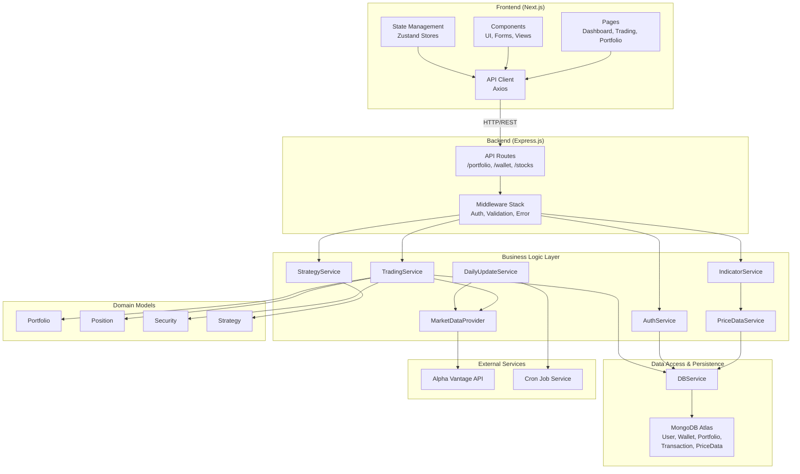
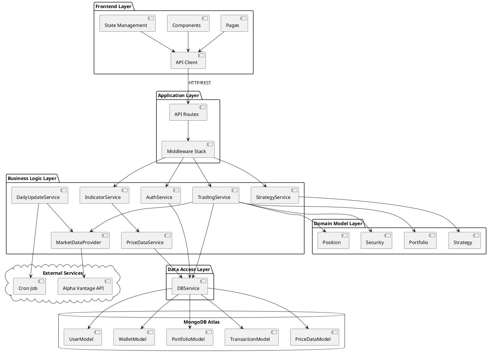

# System Architecture Diagram Creation Guide

## How to Create the Visual Architecture Diagram

### Option 1: Using draw.io (Recommended)

1. Go to [https://app.diagrams.net/](https://app.diagrams.net/)
2. Create a new diagram
3. Select "Blank Diagram" or "Software Architecture"

#### Step-by-Step Instructions:

##### Step 1: Create Layers (Use Containers/Rectangles)

Create 7 main layers from top to bottom:

1. **Presentation Layer** (Top)
2. **Application Layer**
3. **Business Logic Layer**
4. **Domain Model Layer**
5. **Data Access Layer**
6. **Data Persistence Layer**
7. **External Services** (Side or bottom)

##### Step 2: Add Components to Each Layer

**Presentation Layer:**
- Add 3 boxes:
  - "Pages (App Router)" - List: Dashboard, Trading, Portfolio, Transactions, Watchlist, Stock Details, Learn, Recommendations
  - "Components" - List: UI Components, Trading Forms, Portfolio UI, Indicators, Stock Views
  - "State Management (Zustand)" - List: authStore, portfolioStore, walletStore
- Add 1 box below:
  - "API Client (Axios)" - List: auth.ts, portfolio.ts, stocks.ts, trading.ts

**Application Layer:**
- Add 1 box for "Middleware Stack":
  - Helmet (Security)
  - CORS
  - Morgan (Logging)
  - Rate Limit
  - Auth Middleware
  - Validation Middleware
  - Error Middleware
- Add 1 box for "API Routes":
  - /portfolio/*
  - /user/*, /auth/*
  - /stocks/*
  - /wallet/*
  - /backtest/*
  - /paper-trading/*
  - /coupled-trade/*

**Business Logic Layer:**
- Add boxes for services:
  - "TradingService" - buyStock(), sellStock(), getWallet(), getHoldings()
  - "IndicatorService" - SMA, EMA, RSI, MACD, Bollinger Bands
  - "StrategyService" - TrendFollowing, MeanReversion, Momentum, Conservative
  - "MarketDataProvider" - getPrices(), getQuote(), Rate limiting
  - "PriceDataService" - getPriceData(), cacheData(), updateData()
  - "AuthService" - login(), register(), verifyToken()
  - "DailyUpdateService" - Scheduled price updates, Cron job

**Domain Model Layer:**
- Add boxes for models:
  - "Portfolio" - cash, horizon, rebalance()
  - "Position" - quantity, avgCost, P&L
  - "Security" - ticker, name, validate()
  - "Strategy" - name, rules, signals
  - "TechnicalIndicator" - compute(), signal()
  - "User" - userId, name, email

**Data Access Layer:**
- Add 1 box:
  - "DBService" - Abstraction layer with in-memory fallback
  - Methods: savePortfolio(), getUserPortfolios(), saveTransaction(), etc.

**Data Persistence Layer:**
- Add boxes for database models:
  - "UserModel"
  - "WalletModel"
  - "PortfolioModel"
  - "TransactionModel"
  - "PriceDataModel"
  - "BacktestSessionModel"
  - "PaperTradingSessionModel"
- Label as "MongoDB Atlas"

**External Services:**
- Add 1 box:
  - "Alpha Vantage API"
  - TIME_SERIES_DAILY, GLOBAL_QUOTE
  - Rate Limits: 5 calls/min, 500 calls/day
- Add 1 box:
  - "Cron Job Service"
  - Daily Updates

##### Step 3: Add Connections (Arrows)

Draw arrows showing data flow:

1. **Frontend to Backend:**
   - API Client → Application Layer (HTTP/REST API)

2. **Backend Internal:**
   - Routes → Services (multiple connections)
   - Services → Domain Models
   - Services → DBService
   - DBService → MongoDB Models

3. **External Connections:**
   - MarketDataProvider → Alpha Vantage API
   - DailyUpdateService → Alpha Vantage API
   - DailyUpdateService → Cron Job Service

4. **Data Flow:**
   - Use different arrow styles or colors for:
     - Request flow (solid arrows)
     - Response flow (dashed arrows)
     - Background processes (dotted arrows)

##### Step 4: Add Labels and Annotations

- Label each layer clearly
- Add technology stack labels:
  - Frontend: "Next.js, React, TypeScript"
  - Backend: "Express.js, Node.js"
  - Database: "MongoDB Atlas, Mongoose"
- Add protocol labels on connections:
  - "HTTP/REST API" between Frontend and Backend
  - "Mongoose ODM" between Services and Database

### Option 2: Using Lucidchart

1. Go to [https://www.lucidchart.com/](https://www.lucidchart.com/)
2. Select "Software Architecture" template
3. Follow similar steps as draw.io
4. Use Lucidchart's software architecture shapes

### Option 3: Using Mermaid (Text-Based)

For a quick text-based diagram, use Mermaid syntax:



### Option 4: Using PlantUML

For a more detailed UML-style diagram:



## Recommended Layout

### Vertical Layered Architecture (Recommended)

```
┌─────────────────────────────────────┐
│     Presentation Layer (Frontend)    │
└─────────────────────────────────────┘
              ↓
┌─────────────────────────────────────┐
│     Application Layer (Backend)      │
└─────────────────────────────────────┘
              ↓
┌─────────────────────────────────────┐
│     Business Logic Layer (Services) │
└─────────────────────────────────────┘
              ↓
┌─────────────────────────────────────┐
│     Domain Model Layer              │
└─────────────────────────────────────┘
              ↓
┌─────────────────────────────────────┐
│     Data Access Layer               │
└─────────────────────────────────────┘
              ↓
┌─────────────────────────────────────┐
│     Data Persistence Layer (DB)     │
└─────────────────────────────────────┘

┌─────────────────────────────────────┐
│     External Services (Side)        │
└─────────────────────────────────────┘
```

## Color Coding Suggestions

- **Frontend**: Light Blue
- **Backend API**: Light Green
- **Services**: Light Yellow
- **Models**: Light Orange
- **Database**: Light Purple
- **External**: Light Red

## Export Format for Report

Export your architecture diagram as:
- **PNG** (high resolution, at least 300 DPI)
- **PDF** (vector format, scalable)
- **SVG** (vector format, best for documents)

Make sure the diagram:
- Is clear and readable
- Shows all major components
- Indicates data flow direction
- Includes technology stack labels
- Has a legend if using symbols

## What to Include in the Report

1. The visual architecture diagram
2. Brief description of each layer
3. Description of key modules
4. Data flow examples
5. Technology stack summary


## How to Create the Visual Architecture Diagram

### Option 1: Using draw.io (Recommended)

1. Go to [https://app.diagrams.net/](https://app.diagrams.net/)
2. Create a new diagram
3. Select "Blank Diagram" or "Software Architecture"

#### Step-by-Step Instructions:

##### Step 1: Create Layers (Use Containers/Rectangles)

Create 7 main layers from top to bottom:

1. **Presentation Layer** (Top)
2. **Application Layer**
3. **Business Logic Layer**
4. **Domain Model Layer**
5. **Data Access Layer**
6. **Data Persistence Layer**
7. **External Services** (Side or bottom)

##### Step 2: Add Components to Each Layer

**Presentation Layer:**
- Add 3 boxes:
  - "Pages (App Router)" - List: Dashboard, Trading, Portfolio, Transactions, Watchlist, Stock Details, Learn, Recommendations
  - "Components" - List: UI Components, Trading Forms, Portfolio UI, Indicators, Stock Views
  - "State Management (Zustand)" - List: authStore, portfolioStore, walletStore
- Add 1 box below:
  - "API Client (Axios)" - List: auth.ts, portfolio.ts, stocks.ts, trading.ts

**Application Layer:**
- Add 1 box for "Middleware Stack":
  - Helmet (Security)
  - CORS
  - Morgan (Logging)
  - Rate Limit
  - Auth Middleware
  - Validation Middleware
  - Error Middleware
- Add 1 box for "API Routes":
  - /portfolio/*
  - /user/*, /auth/*
  - /stocks/*
  - /wallet/*
  - /backtest/*
  - /paper-trading/*
  - /coupled-trade/*

**Business Logic Layer:**
- Add boxes for services:
  - "TradingService" - buyStock(), sellStock(), getWallet(), getHoldings()
  - "IndicatorService" - SMA, EMA, RSI, MACD, Bollinger Bands
  - "StrategyService" - TrendFollowing, MeanReversion, Momentum, Conservative
  - "MarketDataProvider" - getPrices(), getQuote(), Rate limiting
  - "PriceDataService" - getPriceData(), cacheData(), updateData()
  - "AuthService" - login(), register(), verifyToken()
  - "DailyUpdateService" - Scheduled price updates, Cron job

**Domain Model Layer:**
- Add boxes for models:
  - "Portfolio" - cash, horizon, rebalance()
  - "Position" - quantity, avgCost, P&L
  - "Security" - ticker, name, validate()
  - "Strategy" - name, rules, signals
  - "TechnicalIndicator" - compute(), signal()
  - "User" - userId, name, email

**Data Access Layer:**
- Add 1 box:
  - "DBService" - Abstraction layer with in-memory fallback
  - Methods: savePortfolio(), getUserPortfolios(), saveTransaction(), etc.

**Data Persistence Layer:**
- Add boxes for database models:
  - "UserModel"
  - "WalletModel"
  - "PortfolioModel"
  - "TransactionModel"
  - "PriceDataModel"
  - "BacktestSessionModel"
  - "PaperTradingSessionModel"
- Label as "MongoDB Atlas"

**External Services:**
- Add 1 box:
  - "Alpha Vantage API"
  - TIME_SERIES_DAILY, GLOBAL_QUOTE
  - Rate Limits: 5 calls/min, 500 calls/day
- Add 1 box:
  - "Cron Job Service"
  - Daily Updates

##### Step 3: Add Connections (Arrows)

Draw arrows showing data flow:

1. **Frontend to Backend:**
   - API Client → Application Layer (HTTP/REST API)

2. **Backend Internal:**
   - Routes → Services (multiple connections)
   - Services → Domain Models
   - Services → DBService
   - DBService → MongoDB Models

3. **External Connections:**
   - MarketDataProvider → Alpha Vantage API
   - DailyUpdateService → Alpha Vantage API
   - DailyUpdateService → Cron Job Service

4. **Data Flow:**
   - Use different arrow styles or colors for:
     - Request flow (solid arrows)
     - Response flow (dashed arrows)
     - Background processes (dotted arrows)

##### Step 4: Add Labels and Annotations

- Label each layer clearly
- Add technology stack labels:
  - Frontend: "Next.js, React, TypeScript"
  - Backend: "Express.js, Node.js"
  - Database: "MongoDB Atlas, Mongoose"
- Add protocol labels on connections:
  - "HTTP/REST API" between Frontend and Backend
  - "Mongoose ODM" between Services and Database

### Option 2: Using Lucidchart

1. Go to [https://www.lucidchart.com/](https://www.lucidchart.com/)
2. Select "Software Architecture" template
3. Follow similar steps as draw.io
4. Use Lucidchart's software architecture shapes

### Option 3: Using Mermaid (Text-Based)

For a quick text-based diagram, use Mermaid syntax:


### Option 4: Using PlantUML

For a more detailed UML-style diagram:


## Recommended Layout

### Vertical Layered Architecture (Recommended)

```
┌─────────────────────────────────────┐
│     Presentation Layer (Frontend)    │
└─────────────────────────────────────┘
              ↓
┌─────────────────────────────────────┐
│     Application Layer (Backend)      │
└─────────────────────────────────────┘
              ↓
┌─────────────────────────────────────┐
│     Business Logic Layer (Services) │
└─────────────────────────────────────┘
              ↓
┌─────────────────────────────────────┐
│     Domain Model Layer              │
└─────────────────────────────────────┘
              ↓
┌─────────────────────────────────────┐
│     Data Access Layer               │
└─────────────────────────────────────┘
              ↓
┌─────────────────────────────────────┐
│     Data Persistence Layer (DB)     │
└─────────────────────────────────────┘

┌─────────────────────────────────────┐
│     External Services (Side)        │
└─────────────────────────────────────┘
```

## Color Coding Suggestions

- **Frontend**: Light Blue
- **Backend API**: Light Green
- **Services**: Light Yellow
- **Models**: Light Orange
- **Database**: Light Purple
- **External**: Light Red

## Export Format for Report

Export your architecture diagram as:
- **PNG** (high resolution, at least 300 DPI)
- **PDF** (vector format, scalable)
- **SVG** (vector format, best for documents)

Make sure the diagram:
- Is clear and readable
- Shows all major components
- Indicates data flow direction
- Includes technology stack labels
- Has a legend if using symbols

## What to Include in the Report

1. The visual architecture diagram
2. Brief description of each layer
3. Description of key modules
4. Data flow examples
5. Technology stack summary


